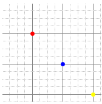
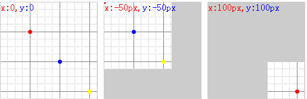

# background-position

下面是我要用到的一个背景图：

HTML页中是162*162的灰色背景DIV块并加入三种不同位置的背景图片，

在浏览器中看到的效果：

从上图可以看到：当为background-position:0 0;时图片的左上角与DIV的左上角是重合的，当我们定位于background-position:-50px -50px;时发现图片向左、上移动了，也就以__DIV的左上角为中心__，图向左移动了50PX，向上也移动了50PX．第三个示例采用的都是正值，可以解解释为图向右、向下移动的效果．这个应该是好理解的．

 

也就是做，左边和上边负值，右边和下边为正值。传递负值的时候，图像向负值方向移动相应像素。