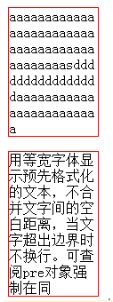
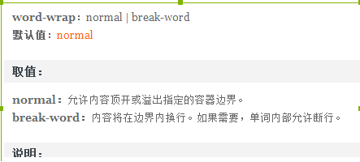

## &lt;p>标签固定宽带内容不换行

遇到一个奇怪的问题：

设置了固定宽度为100px之后，里面传递中文和传递英文，而且宽度肯定是超过100px的，居然还有不同的显示。

期待的显示结果如下：

，但是事实上的显示结果为：

其中的英文居然没有自动换行，而是在一行内显示出来了，真的很奇怪。

 

后来通过查找css文档发现一个word-wrap属性：将其word-wrap值设置为break-word之后就能够在边界内换行了。

