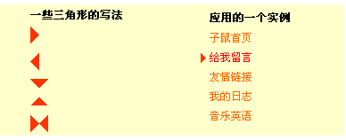
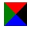

# 使用CSS实现三角

如下是实现的效果，还能够继续调整成你需要的样式。



其实现的具体原理就是先div的宽高都设为0px，然后设置border来显示如上的效果：

 

先看一组效果就能很好理解了：

```
border-top:10px solid red;
border-left:10px solid green;
border-right:10px solid black;
```

效果如下：


左边是border-left，右边是border-right.形成了三角形，

---

想四个border都设定的时候，效果如下：

````
border-top:20px solid red;
border-left:20px solid green;
border-right:20px solid black;
border-bottom:20px solid blue;
````


如果需要的是纯三角边的话，可以设置四个border中top与left的color为透明的即transparent.
