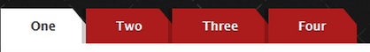

# 实现斜角效果

原理也就是让右上角变成透明罢了。

````
#tabs a {
    box-shadow: -4px 0 0 rgba(0, 0, 0, .2);
    background: #ad1c1c;
    background: linear-gradient(220deg, transparent 10px, #ad1c1c 10px);
    text-shadow: 0 1px 0 rgba(0,0,0,.5);
    color: #fff;
    float: left;
    font: bold 12px/35px 'Lucida sans', Arial, Helvetica;
    height: 35px;
    padding: 0 30px;
    text-decoration: none;}
````

