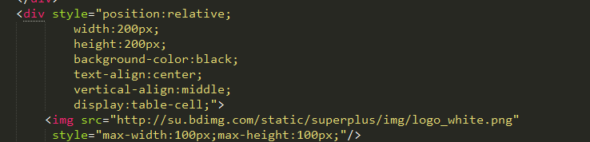
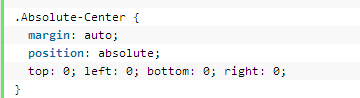
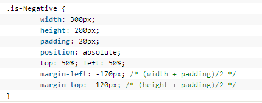

# 居中定位

## 水平居中

1. text-align: center


## 垂直居中

###1,  使用display:table-cell来实现，限制：容器的大小必须有具体的数值，不能用百分比。



效果显示如下：


原理，现在vertical-align:middle好像只在table中起效果了，所以只能把外部的div设为display:table-cell;然后添加上text-align:center;和vertical-align:middle;，这样就能够进行上下左右居中了。

这个方法的弊端是，外部div需要设定width和height的具体指，是用百分比无法达到需要的效果。


###2,  使用margin:auto来实现



需要使用绝对定位，然后上下左右都是0px。margin：auto自动居中。


绝对居中（Absolute Centering）是一种非常不错的技术，除此之外还有一些方法可以满足更多的具体需求，最常见的推荐：NegativeMargins, Transforms,Table-Cell, Inline-Block方式和新出现的Flexbox.方式。这些方法许多文章都有深入讲解，这里只做简单阐述。(觉得自己有些孤陋寡闻了，需要及时了解最新知识撒)

### 3, 负外边距(negative margins)



前提是需要知道居中元素的尺寸，这个原理倒是比较简单，直接绝对定位，然后top,left各50%；自会后就是margin-top与margin-left取负值:都设为width/height的一半。

### 4, 单行文字居中

单行文字，只需height与line-height值相等即可。


### 5, 多行文字居中 

#### 父容器不固定高度
可以使用padding来解决，设置容器的padding上下围相同的固定值，容器的高度会随着内容的增加而增加，这样可以让文字看上去居中

#### 父容器固定高度

固定高度可以采用table模式来居中，目前vertical-align只能在table中生效，然后margin：auto 也只能水平方向居中，而不能垂直方向居中。

````
<div id="boxOuter">
    <div id="box">
        <div id="boxInner">
            Some Content Here
            Some Content Here
        </div>
    </div>
</div>
````

其中boxOuter是最外部的，固定住宽高的，然后里面的boxInner就是需要显示的多行内容。

设置box的width与height为100%,然后display:table。关于boxInner则是宽高为100%，然后display:table-cell,最后使用vertical-align:middle属性。

````
#boxOuter
{
    height:300px;
    width:500px;
    display:inline-block;
}
#box
{
    display:table;
    width:100%;
    height:100%;
}
#boxInner
{
    display:table-cell;
    width:100%;
    height:100%;vertical-align:middle;
}

````