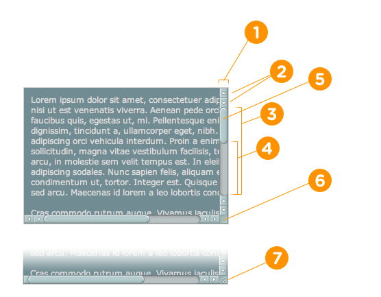

# 自定义滚动条

IE下的滚动条样式，其它浏览器都不兼容。

````
scrollbar-arrow-color: color; /*三角箭头的颜色*/

scrollbar-face-color: color; /*立体滚动条的颜色（包括箭头部分的背景色）*/

scrollbar-3dlight-color: color; /*立体滚动条亮边的颜色*/

scrollbar-highlight-color: color; /*滚动条的高亮颜色（左阴影？）*/

scrollbar-shadow-color: color; /*立体滚动条阴影的颜色*/

scrollbar-darkshadow-color: color; /*立体滚动条外阴影的颜色*/

scrollbar-track-color: color; /*立体滚动条背景颜色*/

scrollbar-base-color:color; /*滚动条的基色*/
````

这些属性能够实现，然后webkit中的实现才是下面主要介绍的：
 
The Different Pieces

````
::-webkit-scrollbar { /* 1 */ } ::-webkit-scrollbar-button { /* 2 */ } ::-webkit-scrollbar-track { /* 3 */ } ::-webkit-scrollbar-track-piece { /* 4 */ } ::-webkit-scrollbar-thumb { /* 5 */ } ::-webkit-scrollbar-corner { /* 6 */ } ::-webkit-resizer { /* 7 */ }
````




The Different States

:horizontal :vertical :decrement :increment :start :end :double-button :single-button :no-button :corner-present :window-inactive


**:horizontal** – The horizontal pseudo-class applies to any scrollbar pieces that have a horizontal orientation.

**:vertical** – The vertical pseudo-class applies to any scrollbar pieces that have a vertical orientation.

**:decrement** – The decrement pseudo-class applies to buttons and track pieces. It indicates whether or not the button or track piece will decrement the view’s position when used (e.g., up on a vertical scrollbar, left on a horizontal scrollbar).

**:increment** – The increment pseudo-class applies to buttons and track pieces. It indicates whether or not a button or track piece will increment the view’s position when used (e.g., down on a vertical scrollbar, right on a horizontal scrollbar).

**:start** – The start pseudo-class applies to buttons and track pieces. It indicates whether the object is placed before the thumb.

**:end** – The end pseudo-class applies to buttons and track pieces. It indicates whether the object is placed after the thumb.

**:double-button** – The double-button pseudo-class applies to buttons and track pieces. It is used to detect whether a button is part of a pair of buttons that are together at the same end of a scrollbar. For track pieces it indicates whether the track piece abuts a pair of buttons.

**:single-button** – The single-button pseudo-class applies to buttons and track pieces. It is used to detect whether a button is by itself at the end of a scrollbar. For track pieces it indicates whether the track piece abuts a singleton button.

**:no-button** – Applies to track pieces and indicates whether or not the track piece runs to the edge of the scrollbar, i.e., there is no button at that end of the track.

**:corner-present** – Applies to all scrollbar pieces and indicates whether or not a scrollbar corner is present.

**:window-inactive** – Applies to all scrollbar pieces and indicates whether or not the window containing the scrollbar is currently active. (In recent nightlies, this pseudo-class now applies to ::selection as well. We plan to extend it to work with any content and to propose it as a new standard pseudo-class.)


##Simple Examples:


````
::-webkit-scrollbar { width: 12px; }

::-webkit-scrollbar-track {

    -webkit-box-shadow: inset 0 0 6px rgba(0,0,0,0.3);

    border-radius: 10px; }

::-webkit-scrollbar-thumb {

    border-radius: 10px;

    -webkit-box-shadow: inset 0 0 6px rgba(0,0,0,0.5);

}
````

原本我以为只能设置全局的滚动条，现在则发现了我是错误的，滚动条可以单独设置给某个div，假设div的类名为demo.则只需如下编写

````
div.demo::-webkit-scrollbar{xxx}
````
格式是这样的，然后根据具体的值来填进去就行了。