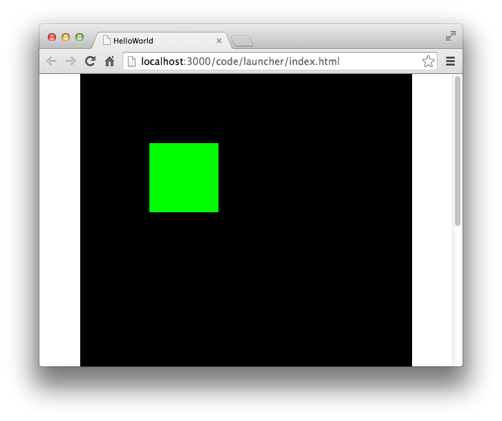
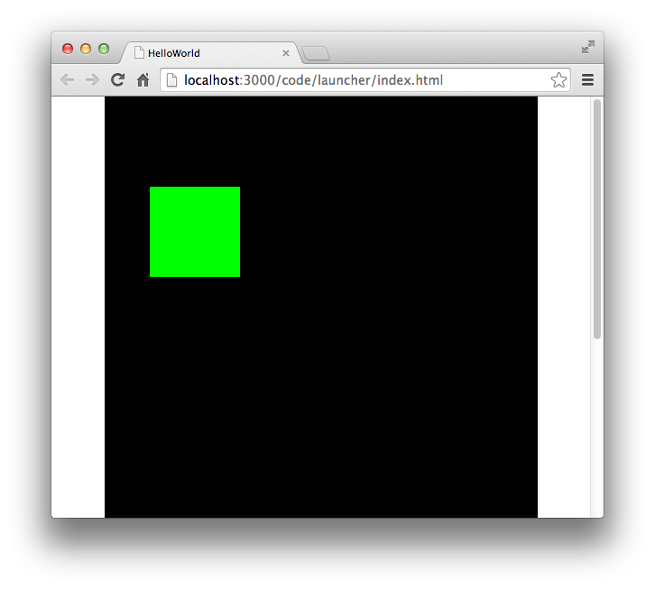

## 锚点的操作


每个显示对象都包含一个锚点,锚点默认位于显示对象的左上角。

 当设置一个显示对象的坐标位置时,会以锚点为参照改变显示对象的绘图位置。同时,锚点相对于显示对象的位置也是可以改变的。


默认锚点位置左上角: (0,0)


````javascript
class AnchorTest extends egret.DisplayObjectContainer
{
    public constructor()
    {
        super();
        this.addEventListener(egret.Event.ADDED_TO_STAGE,this.onAddToStage,this);
    }
    private onAddToStage(event:egret.Event)
    {
        var shp:egret.Shape = new egret.Shape();
        shp.graphics.beginFill( 0x00ff00 );
        shp.graphics.drawRect( 0, 0, 100, 100 );
        shp.graphics.endFill();
        shp.x = 100;
        shp.y = 100;
        this.addChild( shp );
    }
}
````





## 修改锚点

可通过`anchorOffsetX`和 `anchorOffsetY`属性访问修改锚点的位置。


修改上例锚点的位置，让锚点居于正方形左上角x轴 50 像素的位置，代码如下：

```javascript
shp.anchorOffsetX = 50;
```

效果如下：





## 总结

shp.x = 100, 就当距离左边的距离是100px。

这个时候设置x轴的锚点为`shp.anchorOffsetX = 50;`，x轴的锚点为50px，所以显示中，实际距离左边50px。


所以可以得出结论： 

x = (anchorOffsetX) + 真实距离左边的距离

y = (anchorOffsetY) + 真实距离顶边的距离

