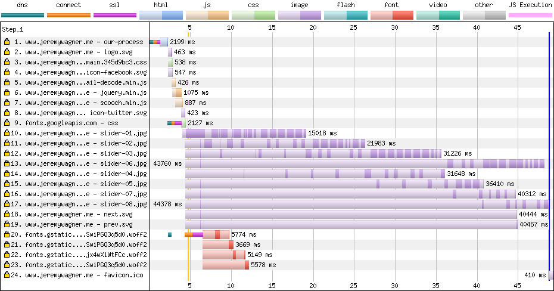
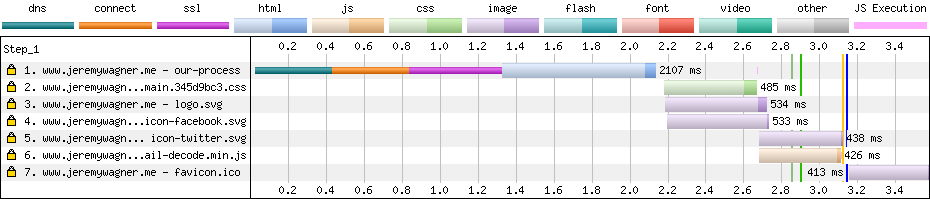

## Adapting to Users with Client Hints

Developing sites that are fast everywhere can be a tricky prospect. The plethora of device capabilities—and the quality of the networks they connect to—can make it seem like an insurmountable task. While we can take advantage of browser features to improve loading performance, how do we know what the user’s device is capable of, or the quality of their network connection? The solution is [client hints](https://tools.ietf.org/html/draft-ietf-httpbis-client-hints-06)!

Client hints are a set of opt-in HTTP request headers that give us insight into these aspects of the user’s device and the network they’re connected to. By tapping into this information server side, we can change *how* we deliver content based on device and/or network conditions. This can help us to create more inclusive user experiences.

It’s All About Content Negotiation

Client hints are another method of *content negotiation*, which means changing content responses based on browser request headers.

One example of content negotiation involves the [`Accept`](https://developer.mozilla.org/en-US/docs/Web/HTTP/Headers/Accept) request header. It describes what *content* types the browser understands, which the server can use to *negotiate* the response. For image requests, the content of Chrome’s `Accept` header is:

```http
Accept: image/webp,image/apng,image/*,*/*;q=0.8
```

While all browsers support image formats like JPEG, PNG, and GIF, Accept tells in this case that the browser *also* supports [WebP](https://developers.google.com/speed/webp/) and [APNG](https://en.wikipedia.org/wiki/APNG). Using this information, we can negotiate the best image types for each browser:

```php
<?php
// Check Accept for an "image/webp" substring.
$webp = stristr($_SERVER["HTTP_ACCEPT"], "image/webp") !== false ? true : false;

// Set the image URL based on the browser's WebP support status.
$imageFile = $webp ? "whats-up.webp" : "whats-up.jpg";
?>
" alt="I'm an image!">
```

Like `Accept`, client hints are another avenue for negotiating content, but in the context of device capabilities and network conditions. With client hints, we can make server side performance decisions based on a user's individual experience, such as deciding whether non-critical resources should be served to users with poor network conditions. In this guide, we’ll describe all the available hints and some ways you can use them to make content delivery more accommodating to users.

Opting in

Unlike the `Accept` header, client hints don’t just magically appear (with the exception of `Save-Data`, which we’ll discuss later). In the interest of keeping request headers at a minimum, you’ll need to opt into which client hints you’ll want to receive by sending an `Accept-CH` header when a user requests a resource:

```http
Accept-CH: Viewport-Width, Downlink
```

The value for `Accept-CH` is a comma-separated list of requested hints the site will use in determining the results for subsequent resource request. When the client reads this header, it’s being told “this site wants the `Viewport-Width` and `Downlink` client hints.” Don’t worry about the specific hints themselves. We’ll get to those in a moment.

There’s also an optional `Accept-CH-Lifetime` header which specifies the length of time, in seconds, the browser should remember the value you set for `Accept-CH` for your origin.

**Note:** Client hints don’t kick in on the navigation request the first time a user visits your site. However, if you persist hints with `Accept-CH-Lifetime`, this information will be available on the navigation request.

You can set these opt-in headers in any back-end language. For example, [PHP’s `header` function](http://php.net/manual/en/function.header.php) could be used. You could even set these opt-in headers with [the `http-equiv` attribute](https://developer.mozilla.org/en-US/docs/Web/HTML/Element/meta#attr-http-equiv) on a `` tag:

```html
<meta http-equiv="Accept-CH" content="Viewport-Width, Downlink">
<meta http-equiv="Accept-CH-Lifetime" content="86400">
```

**Note:** In order for client hints to work at all, your site must be served over HTTPS!

All the client hints!

Client hints describe one of two things: the device your users, well, *use*, and the network they’re using to access your site. Let’s briefly cover all of the hints that are available.

Device hints

Some client hints describe characteristics of the user’s device, usually screen characteristics. Some of them can help you choose the optimal media resource for a given user’s screen, but not all of them are necessarily media-centric.

Before we get into this list, it might be helpful to learn a few key terms used to describe screens and media resolution:

**Intrinsic size:** the actual dimensions of a media resource. For example, if you open an image in Photoshop, the dimensions shown in the image size dialogue describe its *intrinsic size*.

**Density-corrected intrinsic size:** the dimensions of a media resource after it has been corrected for pixel density. It’s the image’s *intrinsic size* divided by a [device pixel ratio](https://developer.mozilla.org/en-US/docs/Web/API/Window/devicePixelRatio). For example, let’s take this markup:

```html

```

Let’s say the intrinsic size of the `1x` image in this case is 320x240, and the `2x` image’s intrinsic size is 640x480. If this markup is parsed by a client installed on a device with a screen device pixel ratio of 2 (e.g., a Retina screen), the `2x` image is requested. The *density-corrected intrinsic size* of the `2x` image is 320x240, since 640x480 divided by 2 is 320x240.

**Extrinsic size:** the size of a media resource after CSS and other layout factors (such as `width` and `height` attributes) have been applied to it. Let’s say you have an `` element that loads an image with a density-corrected intrinsic size of 320x240, but it also has CSS `width` and `height` properties with values of `256px` and `192px` applied to it, respectively. In this example, the *extrinsic size* of that `` element becomes 256x192.

***Figure 1**. An illustration of intrinsic versus extrinsic size. An image gains its extrinsic size after layout factors have been applied to it. In this case, applying CSS rules of `width: 256px;` and `height: 192px;` transforms a 320x240 intrinsically sized image to a 256x192 extrinsically sized one.*

With some terminology under our belt, let’s get into the list of device-specific client hints available to you.

Viewport-Width

`Viewport-Width` is the width of the user’s viewport in CSS pixels:

```http
Viewport-Width: 320
```

This hint can used with other screen-specific hints to deliver different treatments (i.e., crops) of an image which are optimal for specific screen sizes (i.e., [art direction](https://www.smashingmagazine.com/2016/02/automatically-art-directed-responsive-images-go/)), or to omit resources that are unnecessary for the current screen width.

DPR

`DPR`, short for device pixel ratio, reports the ratio of physical pixels to CSS pixels of the user’s screen:

```http
DPR: 2
```

This hint is useful when selecting image sources which correspond to a screen's pixel density (like `x` descriptors do in the [`srcset` attribute](https://developer.mozilla.org/en-US/docs/Web/HTML/Element/img#attr-srcset)).

Width

The `Width` hint appears on requests for image resources fired off by `` or `` tags using the [`sizes` attribute](https://developer.mozilla.org/en-US/docs/Web/HTML/Element/img#attr-sizes). `sizes` tells the browser what the extrinsic size of the resource will be; `Width` uses that extrinsic size to request an image with an intrinsic size that is optimal for the current layout.

For example, let’s say a user requests a page with a 320 CSS pixel wide screen with a DPR of 2. The device loads a document with an `` element containing a `sizes` attribute value of `85vw` (i.e., 85% of the viewport width for all screen sizes). If the `Width` hint has been opted-into, the client will send this `Width` hint to the server with the request for the ``’s `src`:

```http
Width: 544
```

In this case, the client is hinting to the server that an optimal intrinsic width for the requested image would be 85% of the viewport width (272 pixels) multiplied by the screen’s DPR (2), which equals 544 pixels.

This hint is especially powerful because it not only takes into account the density-corrected width of the screen, but also reconciles this critical piece of information with the image’s extrinsic size within the layout. This gives servers the opportunity to negotiate image responses that are optimal for both the screen *and* the layout.

Content-DPR

While you already know that *screens* have a device pixel ratio, resources also have their own pixel ratios. In the simplest resource selection use cases, pixel ratios between devices and resources can be the same. But! In cases where both the `DPR` and `Width` headers are in play, the extrinsic size of a resource can produce scenarios where the two differ. This is where the `Content-DPR` hint comes into play.

Unlike other client hints, `Content-DPR` is not a *request* header to be used by servers, but rather a *response* header servers *must* send whenever `DPR` and `Width` hints are used to select a resource. The value of `Content-DPR` should be the result of this equation:

`Content-DPR` = [Selected image resource size] / ([`Width`] / [`DPR`])

When a `Content-DPR` request header is sent, the browser will know how to scale the given image for the screen’s device pixel ratio and the layout. Without it, images may not scale properly.

Device-Memory

Technically a part of the [Device Memory API](https://www.w3.org/TR/device-memory-1/), `Device-Memory` reveals [the approximate amount of memory](https://www.w3.org/TR/device-memory-1/#sec-device-memory-client-hint-header) the current device has in GiB:

```http
Device-Memory: 2
```

**Note:** Because this information [could be used to fingerprint users](https://blog.mozilla.org/internetcitizen/2018/07/26/this-is-your-digital-fingerprint/), the value of `Device-Memory` is intentionally coarse. Valid values are `0.25`, `0.5`, `1`, `2`, `4`, and `8`.

A possible use case for this hint would be to reduce the amount of JavaScript sent to browsers on devices with limited memory, [as JavaScript is the most resource-intensive content type browsers typically load](https://medium.com/@addyosmani/the-cost-of-javascript-in-2018-7d8950fbb5d4). Or you could send lower DPR images as they use less memory to decode.

Network hints

The [Network Information API](https://wicg.github.io/netinfo/) provides another category of client hints that describe the performance of the user’s network connection. In my opinion, these are the most useful set of hints. With them, we have the ability to tailor experiences to users by changing how we deliver resources to clients on slow connections.

**Note:** Network hint values are predictions based on past latency and bandwidth readings. As such, they’re not 100% accurate, but are assumed to be good enough for client hint use cases.

RTT

The `RTT` hint provides the approximate *Round Trip Time*, in milliseconds, on the application layer. The `RTT` hint, unlike transport layer RTT, includes server processing time.

```http
RTT: 125
```

**Note:** The value of `RTT` is rounded to the nearest 25 milliseconds to prevent fingerprinting.

This hint is useful because of the role latency plays in loading performance. Using the `RTT` hint, we can make decisions based on network responsiveness, which can help speed the delivery of an entire experience (e.g., through omitting some requests).

Downlink

While latency is important in loading performance, bandwidth is influential, too. The `Downlink` hint, expressed in megabits per second (Mbps), reveals the *approximate* downstream speed of the user’s connection:

```http
Downlink: 2.5
```

**Note:** The value of `Downlink` is rounded to the nearest multiple of 25 kilobits per second. Because again, fingerprinting.

In conjunction with `RTT`, `Downlink` can be useful in changing how content is delivered to users based on the quality of a network connection.

ECT

The `ECT` hint stands for *Effective Connection Type*. Its value is one of an enumerated list of connection types, each of which describes [a connection within specified ranges of both `RTT` and `Downlink` values](https://wicg.github.io/netinfo/#effective-connection-types).

This header doesn’t explain what the *actual* connection type is—for example, it doesn’t report whether your gateway is a cell tower or a wifi access point. Rather, it analyzes the current connection’s latency and bandwidth and determines what network profile it resembles most. For example, if you connect through wifi to a slow network, `ECT` may be populated with a value of `2g`, which is the closest approximation of the *effective* connection:

```http
ECT: 2g
```

Valid values for `ECT` are `4g`, `3g`, `2g`, and `slow-2g`. This hint can be used as a starting point for assessing connection quality, and subsequently refined using the `RTT` and `Downlink` hints.

Save-Data

`Save-Data` isn’t so much a hint describing network conditions as it is a user preference stating that pages should send less data.

**Note:** Of all the client hints, `Save-Data` is the only one you *can’t* opt into with `Accept-CH`. Only the user can control whether this hint is sent by toggling Chrome’s [Data Saver feature](https://support.google.com/chrome/answer/2392284) on Android devices.

I prefer to classify `Save-Data` as a network hint because many of the things you would do with it are similar to other network hints. Users may also be likely to enable it in high latency/low bandwidth environments. This hint, when present, always looks like this:

```http
Save-Data: on
```

Here at Google, [we’ve talked about what you can do with `Save-Data`](https://developers.google.com/web/fundamentals/performance/optimizing-content-efficiency/save-data/). The impact it can have on performance can be profound. It’s a signal where users are literally asking you to send them less stuff! If you listen and act on that signal, users will appreciate it.

Tying it all together

What you *do* with client hints depends on you. Because they offer so much information, you have many options. To get some ideas flowing, let’s see what client hints can do for [Sconnie Timber](https://github.com/malchata/client-hints-example), a fictional timber company located in the rural Upper Midwest. [As is often the case in remote areas](https://www.technologyreview.com/s/603083/the-unacceptable-persistence-of-the-digital-divide/), network connections can be fragile. This is where a technology like client hints can really make a difference for users.

Responsive Images

All but the simplest responsive image use cases can get complicated. What if you have multiple treatments *and* variants of the same images for different screen sizes—*and* different formats? That markup gets [*very* complicated *very* quickly](https://dev.opera.com/articles/responsive-images/#changing-image-sizes-high-dpi-images-different-image-types--art-direction-use-case). It’s easy to get it wrong, and easy to forget or misunderstand important concepts (such as `sizes`).

While `` and `srcset` are undeniably *awesome* tools, they can be time-consuming to develop and maintain for complex use cases. We can automate markup generation, but doing so is also difficult because the functionality `` and `srcset` provides is complex enough that their automation needs to be done in a way that maintains the flexibility they provide.

Client hints are can simplify this. Negotiating image responses with client hints could look something like this:

1. If applicable to your workflow, first select an image treatment (i.e., art-directed imagery) by checking the `Viewport-Width` hint.
2. Select an image resolution by checking the `Width` hint and the `DPR` hint, and choosing a source that fits the image’s layout size and screen density (similar to how `x` and `w` descriptors work in `srcset`).
3. Select the most optimal file format the browser supports (something `Accept` helps us do in most browsers).

Where my fictitious timber company client was concerned, I developed a naïve responsive image selection routine in PHP that uses client hints. This meant instead of sending this markup to all users:

```html
<picture>
  <source srcset="company-photo-256w.webp 256w,
                  company-photo-512w.webp 512w,
                  company-photo-768w.webp 768w,
                  company-photo-1024w.webp 1024w,
                  company-photo-1280w.webp 1280w"
          type="image/webp">
  
</picture>
```

I was able to reduce it to the following based on individual browser support:

```html

```

In this example, the `/image` URL is a PHP script followed by parameters rewritten by [mod_rewrite](https://httpd.apache.org/docs/current/mod/mod_rewrite.html). It takes an image filename and additional parameters to help a back-end script choose the best image in the given conditions.

I sense *“But isn’t this just reimplementing `` and `srcset` on the back-end?”* is your first question.

In a way, yes—but with an important distinction: when an application uses client hints to craft media responses, most (if not all) of the work is much easier to automate, which can include a service (such as a CDN) that can do this on your behalf. Whereas with HTML solutions, new markup needs to be written to provide for every use case. Sure, you *can* automate markup generation. If your design or requirements change, though, there’s a good chance you’ll need to revisit your automation strategy in the future.

Client hints make it possible to start with a lossless, high-resolution master image that can then be dynamically resized to be optimal for *any* combination of screen and layout. Unlike `srcset`, which requires you to enumerate a fixed list of possible image candidates for the browser to choose from, this approach can be more flexible. While `srcset` forces you to offer browsers a coarse set of variants—say, `256w`, `512w`, `768w`, and `1024w`—a client-hints powered solution can serve all widths, without a giant pile of markup.

Of course, you don’t *have* to write image selection logic yourself. [Cloudinary uses client hints to craft image responses when you use the `w_auto` parameter](https://cloudinary.com/blog/automatic_responsive_images_with_client_hints), and observed that median users downloaded 42% less bytes when using browsers supporting client hints.

But beware! [Changes in the desktop version of Chrome 67 have removed support for cross-origin client hints](https://cloudinary.com/blog/client_hints_and_responsive_images_what_changed_in_chrome_67). Fortunately, these restrictions don’t affect mobile versions of Chrome, and they'll be lifted altogether for all platforms when work on [Feature Policy](https://wicg.github.io/feature-policy/) is complete.

Helping users on slow networks

*Adaptive performance* is the idea that we can adjust how we deliver resources based on the information client hints makes available to us; specifically information surrounding the current state of the user’s network connection.

Where Sconnie Timber’s site is concerned, we take steps to lighten the load when networks are slow, with `Save-Data`, `ECT`, `RTT`, and `Downlink` headers being examined in our back-end code. When this is done, we generate a network quality score we can use to determine if we should intervene for a better user experience. This network score is between `0` and `1`, where `0` is the worst network possible network quality, and `1` is the best.

Initially, we check if `Save-Data` is present. If it is, the score is set to `0`, as we’re assuming the user wants us to do whatever is necessary to make the experience lighter and faster.

If `Save-Data` is absent, however, we move on and weigh the values of the `ECT`, `RTT`, and `Downlink` hints to calculate a score that describes network connection quality. The [network score generation source code](https://github.com/malchata/client-hints-example/blob/master/includes/functions.php#L8) is available on Github. The takeaway is, if we use the network-related hints in *some* fashion, we can make experiences better for those who are on slow networks.

***Figure 2**. An “about us” page for a local business site. The baseline experience includes web fonts, JavaScript to drive a carousel and accordion behavior, as well as content images. These are all things we can omit when network conditions are too slow to load them quickly.*

When sites adapt to the information client hints provide, we don’t have to adopt an “all or nothing” approach. We can intelligently decide which resources to send. We can modify our responsive image selection logic to send lower quality images for a given display to speed up loading performance when network quality is poor.

In this example, we can see the impact client hints have when it comes to improving the performance of sites on slower networks. Below is a WebPagetest waterfall of a site on a slow network that doesn’t adapt to client hints:

***Figure 3**. A resource heavy site loading images, scripts, and fonts on a slow connection.*

And now a waterfall for the same site on the same slow connection, except this time, the site uses client hints to eliminate non-critical page resources:

***Figure 4**. The same site on the same connection, only the “nice to have” resources are excluded in favor of faster loading.*

Client hints reduced the page load time from over 45 seconds to *less than a tenth of that time*. The benefits of client hints in this scenario can’t be emphasized enough and can be a serious boon to users seeking critical information over slow networks.

Furthermore, it’s possible to use client hints without breaking the experience for browsers that don’t support them. For example, if we want adjust resource delivery suing the value of the `ECT` hint while still delivering the full experience for non-supporting browsers, we can set fall back to a default value like so:

```php
// Set the ECT value to "4g" by default.
$ect = isset($_SERVER["HTTP_ECT"]) ? $_SERVER["HTTP_ECT"] : "4g";
```

Here, `"4g"` represents the highest quality network connection the `ECT` header describes. If we initialize `$ect` to `"4g"`, browsers that don’t support client hints won’t be affected. Opt-in FTW!

Mind those caches!

Whenever you change a response based on an HTTP header, you need to be aware of how caches will handle future fetches for that resource. [The `Vary` header](https://developer.mozilla.org/en-US/docs/Web/HTTP/Headers/Vary) is indispensable here, as it keys cache entries to the value of the request headers supplied to it. Simply put, if you modify any response based on a given HTTP request header, you should almost always include request that header in `Vary` like so:

```http
Vary: DPR, Width
```

There’s a *big* caveat to this, though: You never want to `Vary` cacheable responses on a frequently changing header (like `Cookie`) because those resources become effectively uncacheable. Knowing this, you might want to avoid `Vary`ing on client hint headers such as `RTT` or `Downlink`, because those are connection factors that could change quite often. If you want to modify responses on those headers, consider keying only the `ECT` header, which will minimize cache misses.

Of course, this only applies if you’re caching a response in the first place. For example, you won’t cache HTML assets if their content is dynamic, because that can break the user experience on repeat visits. In cases like these, feel free to modify such responses on whatever basis you feel is necessary and not concern yourself with `Vary`.

Client hints in service workers

Content negotiation isn’t just for servers anymore! Because service workers act as proxies between clients and the servers, you have control over how resources are delivered via JavaScript. This includes client hints. In the service worker `fetch` event, you can use the `event` object’s [`request.headers.get`](https://developer.mozilla.org/en-US/docs/Web/API/Request/headers) method to read a resource’s request headers like so:

```javascript
self.addEventListener("fetch", event => {
  let dpr = event.request.headers.get("DPR");
  let viewportWidth = event.request.headers.get("Viewport-Width");
  let width = event.request.headers.get("Width");

  event.respondWith(async function() {
    // Do what you will with these hints!
  }());
});
```

**Warning:** Because not all browsers support client hints, you’ll need to check what values `event.request.headers.get` returns. A possible alternative approach is to record JS equivalents such as [`window.devicePixelRatio`](https://developer.mozilla.org/en-US/docs/Web/API/Window/devicePixelRatio) or [`window.innerWidth`](https://developer.mozilla.org/en-US/docs/Web/API/Window/innerWidth) to [`IndexedDB`](https://developers.google.com/web/ilt/pwa/working-with-indexeddb), which is accessible in the service worker scope.

Any client hint header you opt into can be read in this fashion. Though that’s not the only way you can get some of this information. Network-specific hints can be read in these equivalent JavaScript properties in the `navigator` object:

| Client hint     | JS equivalent                        |
| --------------- | ------------------------------------ |
| `ECT`           | `navigator.connection.effectiveType` |
| `RTT`           | `navigator.connection.rtt`           |
| `Save-Data`     | `navigator.connection.saveData`      |
| `Downlink`      | `navigator.connection.downlink`      |
| `Device-Memory` | `navigator.deviceMemory`             |

Because these APIs aren’t available everywhere you need feature check with the [`in` operator](https://developer.mozilla.org/en-US/docs/Web/JavaScript/Reference/Operators/in):

```javascript
if ("connection" in navigator) {
  // Work with netinfo API properties in JavaScript!
}
```

From here, you can use logic similar to what you would use on the server, except you don’t *need* a server to negotiate content with client hints. Service workers alone have the power to make experiences faster and more resilient due to the added ability they have to serve content when the user is offline.

Wrapping up

With client hints, we have the power to make experiences faster for users in a fully progressive way. We can serve media based on the user’s device capabilities in a way that makes serving responsive images easier than relying on `` and `srcset`, especially for complex use cases. This enables us to not only reduce time and effort on the development side, but also to optimize resources—particularly images—in a way that targets user’s screens more finely than and srcset can.

Perhaps more importantly, we can sniff out poor network connections and bridge the gap for users by modifying what we send—and how we send it. This can go a *long* way in making sites easier to access for users on fragile networks. Combined with service workers, we can create incredibly fast sites that are available offline.

While client hints are only available in Chrome—and Chromium-based browsers—it’s possible to use them in such a way that doesn’t encumber browsers that don’t support them. Consider using client hints to create truly inclusive and adaptable experiences that are aware of every user’s device capabilities, and the networks they connect to. Hopefully, other browser vendors will see the value of them and show intent to implement.

Resources

- [Automatic Responsive Images with Client Hints](https://cloudinary.com/blog/automatic_responsive_images_with_client_hints)
- [Client Hints and Responsive Images—What Changed in Chrome 67](https://cloudinary.com/blog/client_hints_and_responsive_images_what_changed_in_chrome_67)
- [Take a (Client) Hint!](https://www.youtube.com/watch?v=md7Ua82fPe4) ([Slides](https://jlwagner.net/talks/take-a-client-hint))
- [Delivering Fast and Light Applications with `Save-Data`](https://developers.google.com/web/fundamentals/performance/optimizing-content-efficiency/save-data/)

*Thank you to [Ilya Grigorik](https://twitter.com/igrigorik), [Eric Portis](https://twitter.com/etportis), [Jeff Posnick](https://twitter.com/jeffposnick), [Yoav Weiss](https://twitter.com/yoavweiss), and [Estelle Weyl](https://twitter.com/estellevw) for their valuable feedback and edits on this article.*