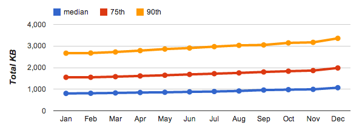

## Optimizing Content Efficiency

我们的网络应用在范围、目标和功能上都在不断增长 - 这是好事。不过，向着更丰富网络这一目标高歌猛进也在推动另一种趋势：每个应用下载的数据量都在持续稳步增长。为提供卓越的性能，我们需要优化每一个字节的传送！

现代网络应用是什么样子？[HTTP Archive](http://httparchive.org/) 可帮助我们回答这个问题。该项目追踪网络的构建方式，具体方法是：定期抓取最受欢迎的网站（Alexa 百万热门网站列表中的超过 300,000 个网站）的信息，并记录和汇总每个单独目标的数字资源、内容类型以及其他元数据的分析数据。

|            | 第 50 百分位 | 第 75 百分位 | 第 90 百分位 |
| ---------- | ------------ | ------------ | ------------ |
| HTML       | 13 KB        | 26 KB        | 54 KB        |
| 图像       | 528 KB       | 1213 KB      | 2384 KB      |
| JavaScript | 207 KB       | 385 KB       | 587 KB       |
| CSS        | 24 KB        | 53 KB        | 108 KB       |
| 其他       | 282 KB       | 308 KB       | 353 KB       |
| **合计**   | **1054 KB**  | **1985 KB**  | **3486 KB**  |

以上数据呈现的是 2013 年 1 月至 2014 年 1 月访问热门网站所需下载字节数的增长趋势。当然，并非每个网站的增长率都相同，也并非每个网站都需要下载相同大小的数据，正因如此，我们才会重点说明分布范围内以下这几个不同的分位数：第 50（中位数）、第 75 和第 90。

在 2014 年初，中位数网站需要进行 75 次请求，一共需要传送 1054KB 字节，并且上一年度全年总字节数（和请求数）一直稳步增长。这一情况本身并没那么希奇，但它确实带来了重要的性能影响：没错，互联网速度越来越快，但不同国家的增长率并不相同，并且许多用户仍受制于流量封顶和昂贵的流量套餐方案，特别是在移动设备上。

与桌面应用不同，网络应用不需要单独的安装过程：只需输入网址，便可启动和运行 - 这是网络的一个关键特色。不过，要做到这一步，**我们通常需要获取几十个（有时甚至是几百个）不同的资源，所有这些资源加起来的数据量高达几兆字节，并且必须在短短几百毫秒内汇聚起来，以实现我们想要达到的即时网络体验。**

在满足上述要求的前提下实现即时网络体验绝非易事，优化内容效率至关重要的原因就在于此：避免不必要的下载、通过各种压缩技术优化每个资源的传送编码以及尽可能利用缓存来避免多余的下载。