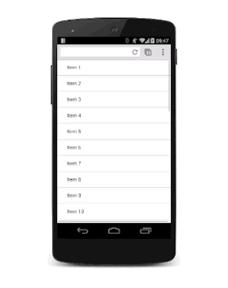
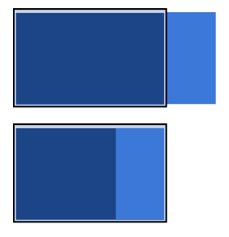

## Animating Between Views

Often, you want to move users between views in your application, whether that's from a list to a details view, or show a sidebar navigation. Animations between these views keep the user engaged and add even more life to your projects.

TL;DR

- Use translations to move between views; avoid using `left`, `top`, or any other property that triggers layout.
- Ensure that any animations you use are snappy and the durations are kept short.
- Consider how your animations and layouts change as the screen sizes go up; what works for a smaller screen may look odd when used in a desktop context.

What these view transitions look and behave like depends on the type of views you’re dealing with. For example, animating a modal overlay on top of a view should be a different experience from transitioning between a list and details view.

**Success:** Try to maintain 60fps for all of your animations. That way, your users won't see stuttering animations that interfere with their experience. Ensure that any animating element has `will-change` set for anything you plan to change well ahead of the animation starting. For view transitions, it’s highly likely you will want to use `will-change: transform`.

Use translations to move between views



To make life easier, assume that there are two views: a list view and a details view. As the user taps a list item inside the list view, the details view slides in, and the list view slides out.


To achieve this effect, you need a container for both views that has `overflow: hidden` set on it. That way, the two views can both be inside the container side-by-side without showing any horizontal scrollbars, and each view can slide side-to-side inside the container as needed.

The CSS for the container is:

```css
.container {
  width: 100%;
  height: 100%;
  overflow: hidden;
  position: relative;
}
```

The position of the container is set as `relative`. This means that each view inside it can be positioned absolutely to the top left corner and then moved around with transforms. This approach is better for performance than using the `left` property (because that triggers layout and paint), and is typically easier to rationalize.

```css
.view {
  width: 100%;
  height: 100%;
  position: absolute;
  left: 0;
  top: 0;

  /* let the browser know we plan to animate
     each view in and out */
  will-change: transform;
}
```

Adding a `transition` on the `transform` property provides a nice slide effect. To give it a nice feel, it’s using a custom `cubic-bezier` curve, which we discussed in the [Custom Easing guide](https://developers.google.com/web/fundamentals/design-and-ux/animations/custom-easing).

```css
.view {
  transition: transform 0.3s cubic-bezier(0.465, 0.183, 0.153, 0.946);
}
```

The view that is offscreen should be translated to the right, so in this case the details view needs to be moved:

```css
.details-view {
  transform: translateX(100%);
}
```

Now a small amount of JavaScript is necessary to handle the classes. This toggles the appropriate classes on the views.

```
var container = document.querySelector('.container');
var backButton = document.querySelector('.back-button');
var listItems = document.querySelectorAll('.list-item');

/**
 * Toggles the class on the container so that
 * we choose the correct view.
 */
function onViewChange(evt) {
  container.classList.toggle('view-change');
}

// When you click a list item, bring on the details view.
for (var i = 0; i < listItems.length; i++) {
  listItems[i].addEventListener('click', onViewChange, false);
}

// And switch it back again when you click the back button
backButton.addEventListener('click', onViewChange);
```

Finally, we add the CSS declarations for those classes.

```css
.view-change .list-view {
  transform: translateX(-100%);
}

.view-change .details-view {
  transform: translateX(0);
}
```

[Try it](https://googlesamples.github.io/web-fundamentals/fundamentals/design-and-ux/animations/inter-view-animation.html)

You could expand this to cover multiple views, and the basic concept should remain the same; each non-visible view should be offscreen and brought on as needed, and the currently onscreen view should be moved off.

**Caution:** Making this kind of hierarchy in a cross-browser way can be challenging. For example, iOS requires an additional CSS property, `-webkit-overflow-scrolling: touch`, to "reenable" fling scrolling, but you don’t get to control which axis that’s for, as you can with the standard overflow property. Be sure to test your implementation across a range of devices!

In addition to transitioning between views, this technique can also be applied to other slide-in elements, like sidebar navigation elements. The only real difference is that you shouldn’t need to move the other views.

Ensure that your animation works with larger screens



For a larger screen, you should keep the list view around all the time rather than removing it, and slide on the details view from the right-hand side. It’s pretty much the same as dealing with a navigation view.