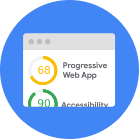

## How To Think About Speed Tools

Google has put out a lot of guidance around performance data and performance tooling. The goal of this infographic is to consolidate this guidance for developers and marketers to help them understand how to think about performance and navigate all of Google's performance tool offerings.

[Download the PDF version](https://developers.google.com/web/fundamentals/performance/speed-tools/pdf/Infographic-How_To_Think_About_Speed_Tools.pdf)

Common myths about performance

MYTH 1

**User experience can be captured with a single metric.**
Good user experience is not captured by a single point in time. It's composed of a series of key milestones in your users' journey. Understand the different metrics and track the ones that are important to your users' experience.

MYTH 2

**User experience can be captured with a single “representative user.”**
Real-world performance is highly variable due to differences in users’ devices, network connections, and other factors. Calibrate your lab and development environment to test a variety of such different conditions. Use field data to inform selection of test parameters for device type (i.e., mobile vs. desktop), network connections (i.e., 3G or 4G), and other key variables.

MYTH 3

**My website loads fast for me, so it should load fast for my users.**
The devices and networks that developers test load performance on are often much faster than what your users actually experience. Use field data to understand what devices and networks your users are on and appropriately mirror those conditions when you test performance.

Understanding lab vs. field data

Lab data

Lab data is performance data collected within a controlled environment with predefined device and network settings. This offers reproducible results and debugging capabilities to help identify, isolate, and fix performance issues.

Strengths

- Helpful for debugging performance issues
- End-to-end and deep visibility into the UX
- Reproducible testing and debugging environment

Limitations

- Might not capture real-world bottlenecks
- Cannot correlate against real-world page KPIs

**Note:** Tools like [Lighthouse](https://developers.google.com/web/tools/lighthouse/) and [WebPageTest](https://www.webpagetest.org/) collect this type of data.

Field data

(Also called Real User Monitoring or RUM)
Field data is performance data collected from real page loads your users are experiencing in the wild.

Strengths

- Captures true real-world user experience
- Enables correlation to business key performance indicators

Limitations

- Restricted set of metrics
- Limited debugging capabilities

**Note:** Public data sets like [Chrome User Experience Report](https://developers.google.com/web/tools/chrome-user-experience-report/) and performance tools like [PageSpeed Insights](https://developers.google.com/speed/pagespeed/insights/) speed score report this type of data.

What are the different performance tools?

[Lighthouse](https://developers.google.com/web/tools/lighthouse/)

Gives you personalized advice on how to improve your website across performance, accessibility, PWA, SEO, and other best practices.

[WebPageTest](https://www.webpagetest.org/)

Allows you to compare performance of one or more pages in controlled lab environment, and deep dive into performance stats and test performance on a real device. You can also run Lighthouse on WebPageTest.

[TestMySite](https://testmysite.thinkwithgoogle.com/)

Allows you to diagnose webpage performance across devices and provides a list of fixes for improving the experience from Webpagetest and PageSpeed Insights.

[PageSpeed Insights](https://developers.google.com/speed/pagespeed/insights/)

Shows speed field data for your site, alongside suggestions for common optimizations to improve it.

[Speed Scorecard](https://www.thinkwithgoogle.com/feature/mobile/)

Allows you to compare your mobile site speed against your peers in over 10 countries. Mobile site speed is based on real-world data from the Chrome User Experience Report.

[Impact Calculator](https://www.thinkwithgoogle.com/feature/mobile/)

Allows you to estimate the potential revenue opportunity of improving your mobile site speed, based on benchmark data from Google Analytics.

[Chrome Developer Tools](https://developers.google.com/web/tools/chrome-devtools/)

Allows you to profile the runtime of a page, as well as identify and debug performance bottlenecks.

So you're a...

**Marketer or developer trying to build a business case for improving user experience of your website. You speak dollars and cents and are looking for monetary figures that can help you quantify the opportunity cost and expected lift.**

- Use the **[Speed Scorecard](https://www.thinkwithgoogle.com/feature/mobile/)** to see how your mobile site speed compares against your peers in more than 10 countries. Scores are based on real-world data from Chrome User Experience Report.
- Use the **[Impact Calculator](https://www.thinkwithgoogle.com/feature/mobile/)** to estimate the potential revenue opportunity of improving your mobile site speed. Impact is driven by benchmark data from Google Analytics.
- Use **[TestMySite](https://testmysite.thinkwithgoogle.com/)** to test your page’s mobile loading time alongside industry benchmarks and to learn how simple fixes can speed up your site and decrease visitor loss; TestMySite is currently powered by WebPageTest and PageSpeed Insights.

**Developer trying to understand current performance of your site, as experienced by real-world Chrome users, and looking for audit recommendations against top industry trends and guidelines.**

**[PageSpeed Insights](https://developers.google.com/speed/pagespeed/insights/)** helps you understand the real-world performance of your site, as experienced by Chrome users, and recommends optimization opportunities.

**Developer trying to understand and audit a website against modern web performance best practices.**

**[Lighthouse](https://developers.google.com/web/tools/lighthouse/)** contains a comprehensive set of performance opportunities; it provides you with a list of performance opportunities missing from your page and the time saved by implementing each optimization, which can help you understand what you should do.

**Developer looking for technical guidance on how to debug/deep dive into the performance of your site.**

**[Chrome Developer Tools](https://developers.google.com/web/tools/chrome-devtools/)** (CDT) contains a Performance Panel that allows you to drill down into performance issues with your site by profiling your site with customized configurations, allowing you to track down performance bottlenecks. You can use CDT on either production or development versions of a website.

**[WebPageTest](https://www.webpagetest.org/)** contains an advanced suite of metrics and trace viewers. It enables deep diving into the performance of your site on real mobile hardware with network conditions.