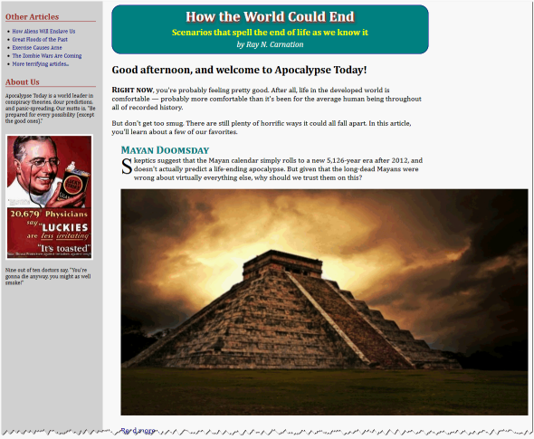
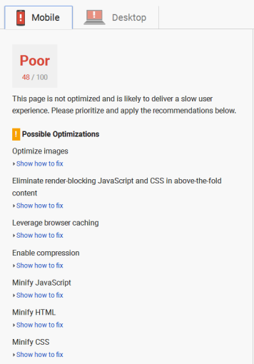
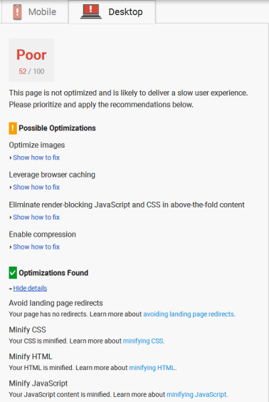
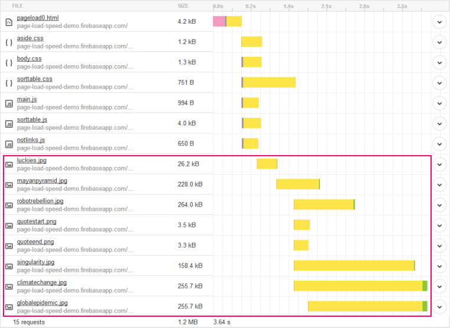
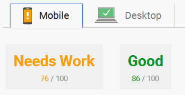
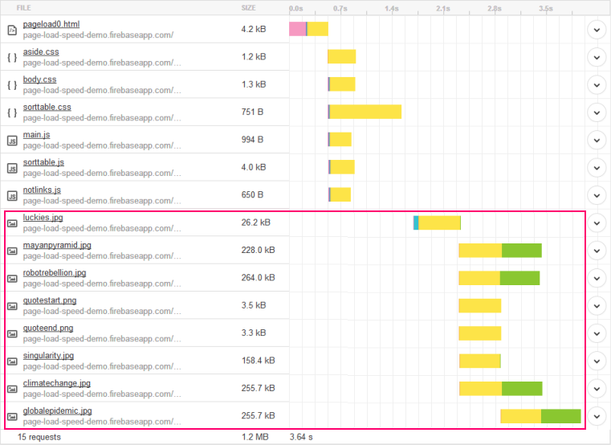
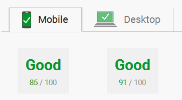
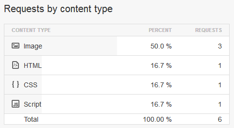
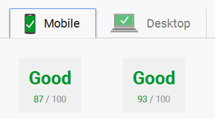

## Wrap-up and Demo

We've now explored various ways to improve page load time. These techniques are "low-hanging fruit" -- simple efforts that produce big performance wins. But talk is cheap; we have not yet actually seen the techniques in action, so finish up by doing that.

To demonstrate the techniques' effectiveness, we will run various speed tests on different versions of a web page, beginning with no optimization and progressing through some of the speed-up techniques we've discussed, specifically text resource optimization, graphics resource optimization, and HTTP request reduction.

The original target is a simple, single HTML page with text, images, CSS, and JavaScript, hosted on Firebase here: https://page-load-speed-demo.firebaseapp.com/pageload0.html. Have a quick look at that, and then we can start improving it.

**Note:** The source code for all versions of the demo page referenced in this document can be found in [this GitHub repository](https://github.com/GoogleChromeLabs/FastPageLoadDemo).

One of the prime considerations in page speed is First Meaningful Paint (FMP), a measure of how users perceive page performance. FMP refers to the time it takes for a page's primary content to appear on the screen. The definition of "primary content" may, of course, differ depending on the page type. For a news article, the primary content might be the headline and the text "above the fold"; for a search engine page, the primary content would be its search results; for an art museum page, the primary content might be a series of thumbnail images and short descriptions.

Another major factor is raw load speed, a measure of how long it takes from the first downloaded byte until the page is completely loaded. Although this is an empirical observation, it may not accurately reflect the user's perception of usable content. That is, viewable content may be on-screen and perceived as usable long before the page load is technically complete.

Clearly, the perception of "page load speed", as opposed to its literal measurement, is a somewhat subjective aspect of the user experience, and is affected by many factors. Perceived performance is a prime indicator of page load speed and, by extension, user satisfaction. While completely objective measurement may ultimately be impossible, that doesn't mean we just guess.

Testing Tools

There are many, many tools available to help determine a page's load speed, far too many to list here. For this article, we will use three online services to help us see the results of our improvement efforts.

- [Google PageSpeed Insights](http://tinyurl.com/m65jex6)
- [WebPageTest](https://www.webpagetest.org/)
- [Pingdom](https://tools.pingdom.com/)

Why three tools? Because different testing services use different methods and algorithms to test speed; they run their tests on different machines and browsers from different locations; they report different results, and report them in different ways. You may find it disconcerting that the same page can test quite differently across tools, but that is the reality of testing.

Rather than perceiving this as a negative, think of it as simply a way to get more and better data. No single testing tool gives you the whole story. Instead of relying on one tool, use multiple tools and run the tests multiple times to get the best and most information you can about specific focus points of your page, and then adjust accordingly.

The Original Page

Let's get a baseline by looking at various performance audits on the original page. It is admittedly quite sloppy -- raw text, render blockers, large images, too many external files -- but it ultimately loads and displays as it should. Our job is to use available tools to identify some specific things we can improve based on what we've seen in the preceding articles. Here's part of the page.

 *Apocalypse Today home page*

Let's run it through the testing services.

**Note:** You may run this same page through the same services and get different results. Again, that's the reality of testing.

**PageSpeed Insights** scores the page poorly, providing separate ratings at 48/100 for mobile devices and 50/100 for desktop devices, but does not give us a raw load time. Among its observations, it correctly notes that the page's HTML, CSS, and JavaScript are not minified.

 *PageSpeed Insights, original page*

**Pingdom** gives the page a "B" rating and an 81/100 score, which doesn't sound that bad. But, more helpfully, it reports a sub-par 4.73 second load time, and ranks the page among other sites it has tested, placing it in only the 33rd percentile.

 *Pingdom, original page*

**WebPageTest** by default runs three consecutive tests and averages the results, a unique feature among test services. Its results include a Document Complete load time of 2.743 seconds and total load time of 2.831 seconds, both significantly less than Pingdom's report.

 *WebPageTest, original page*

WebPageTest also includes a number of graphical reports, including filmstrip and video views (both very nice), and these handy content breakdown pie charts.

 *WebPageTest, original page*

As you can see, the original page's load characteristics aren't very good. It should also be immediately apparent that its characteristics aren't measured and reported identically by the various tools. The best approach, then, is to focus on a few major improvement avenues, and retest after each change to determine whether it achieved the desired effect.

Text Content

Our demo page largely consists of text-based resources: the main HTML page content and structure plus one or more Cascading Style Sheet and JavaScript files. That text may not be the page's major hangup, but it is a place to start, as it can all be minified to save download time.

Using some of the tools mentioned in the **Text Content** article, we minified the HTML, CSS, and JavaScript and redeployed the site to the server.

**PageSpeed Insights** delivered a modest, but interesting, report, correctly noting that the modified page's HTML, CSS, and JavaScript are minified.

 *PageSpeed Insights, text resources minified*

Both the mobile and desktop scores improved by just 1% (49 and 52 respectively), indicating that minification had only a small effect. But in fact, minifying the text resources resulted in a 32% reduction in actual character count. Because this is a fairly small page, the resulting speed improvement isn't large, but the *percentage* of size reduction is very significant.

As before, there are no raw speed numbers, but even this report demonstrates that removing whitespace speeds up your page.

**Pingdom**'s overall grade didn't change, but the page's load time dropped by 1.3 seconds, and its percentile ranking jumped to 47.

 *Pingdom, text resources minified*

The load time improvement is more obvious here than in the PageSpeed Insights report, and a speed-up of over a second is certainly a worthwhile result for very little effort.

**WebPageTest** interestingly reports no significant change in either Document Complete or total load time.

 *WebPageTest, text resources minified*

However, a bit of hovering over the (tiny) pie slices in the content breakdown charts shows significant reductions in the character counts and relative proportions of the text components: HTML (previously 11,886/0.9%, now 9,237/0.7%), CSS (previously 4,443/0.4%, now 3,295/0.3%), and JavaScript (previously 14,471/1.2%, now 8,060/0.6%). The individual numbers seem small, but that fact is that minification delivered an overall reduction in text resources of nearly one-third.

 *WebPageTest, text resources minified*

Interestingly, despite the lack of an overall raw speed increase, WebPageTest's report shows that two of its internal algorithm results go in different directions. The page's Speed Index went up from 1699 to 1797 (about 5% slower), and its First Interactive time (a beta feature) went down from 1.266 seconds to 1.133 seconds (about 10% faster). While those measurements are somewhat subjective, they nevertheless affect how fast the user perceives the site to be. And always remember that *user perception* is the ultimate arbiter of performance.

**Update:** The "Time to First Interactive" metric is on the path to deprecation in favor of the more accurate "Time to Consistently Interactive". We encourage you to use the [WebPageTest Easy mode](https://webpagetest.org/easy) and select the Mobile checkbox, which will generate a Lighthouse report. Then click the *Lighthouse PWA Score* at the top of the page to see the full Lighthouse Progressive Web App report, including the new Consistently Interactive metric.

Here is the text-minified version: https://page-load-speed-demo.firebaseapp.com/pageload1.html.

Graphical Content

Another area ripe for improvement in this page is its over/misuse of graphics. This is not to say that the images aren't important to the page, just that they could be handled better. Have another look at the WebPageTest pie charts just above; the page's images comprise 53.3% of the HTTP requests and 98.3% of the downloaded bytes.

There are eight images in the original page: the five main article pictures, the vintage Luckies advertisement, and the opening and closing quote graphics around the pull quote. One of Pingdom's additional charts illustrates the time spent waiting for and downloading the images.

 *Pingdom, original page*

There is a lot of room for improvement here.

Based on the techniques discussed in the **Graphical Content** article, we applied various improvements to the images (even the small ones), including:

- physical resizing,
- establishing best format,
- reducing quality,
- compression, and
- removing metadata.

**Note:** For this and all subsequent tests in this article, we always started with the original, unmodified page, and made new copies of all resources in order to prevent any one test's procedures or results from contaminating another test.

Here are the results of the improvements for each image.

| Original image     | Best file type | Starting size | Final size | Reduction |
| ------------------ | -------------- | ------------- | ---------- | --------- |
| climatechange.jpg  | jpg            | 256k          | 16k        | 94%       |
| globalepidemic.jpg | jpg            | 256k          | 20k        | 92%       |
| luckies.jpg        | jpg            | 26k           | 11k        | 57%       |
| mayanpyramid.jpg   | jpg            | 228k          | 15k        | 93%       |
| quoteend.png       | png            | 3k            | 2k         | 33%       |
| quotestart.png     | png            | 3k            | 2k         | 33%       |
| robotrebellion.jpg | jpg            | 264k          | 20k        | 92%       |
| singularity.jpg    | jpg            | 158k          | 10k        | 94%       |

It's worthwhile here to report a few observations about the improvement process.

1. While some of the jpg images were slightly smaller when saved as gifs, their quality was visibly compromised. Thus, in each case, the "best" file type turned out to be the original file type, even if it was a bit larger than the smallest saved-as type.
2. Any size retention as a result of that visual inspection was completely compensated for by the physical size (width/height) reduction and image compression. The dimensions of the hero images for the articles were reduced by one-third, from 900x500px to 600x333px. Interestingly, that 33% reduction typically resulted in a 50% file size difference.
3. Although compression on the large images at default settings (no special tweaking) delivered both surprisingly low (3%) and satisfyingly high (50%) results, the single biggest improvement factor across the board was *reduction in jpg quality*. All jpgs were saved at 50% quality but still retained their visual clarity, resulting in much smaller file sizes at no visual perception cost. (We probably could have saved them at even lower qualities, but stopped at 50%.)

Let's now see how the image improvements affected the page load time. Remember, this version is based on the original page, not the version with minified text resources, so these results reflect only improvements directly related to image optimization.

**PageSpeed Insights** reports significant improvement for both mobile and desktop environments. Although the images are definitely loading faster, they are probably still too large (width/height) to fit comfortably on some mobile screens.

 *PageSpeed Insights, optimized images*

**Pingdom** hasn't upgraded the site's overall performance grade, but does show a much faster load time and a far better percentile ranking than the original.

 *Pingdom, optimized images*

Pingdom's timeline report also shows significant improvement in the wait/load times for the images. They are getting to the browser much faster than before.

 *Pingdom, optimized images*

**WebPageTest** also reports much faster load times than the original, for both Document Complete and Fully Loaded states.

 *WebPageTest, optimized images*

And, on its content breakdown chart, note that while the number of image requests as a percentage of total requests has of course not changed (we'll address HTTP requests next), the number of image bytes as a percentage of total bytes downloaded has dropped sharply, from 98.3% to 75.8%. That is, the browser spent 22.5% less time downloading images than before, a significant improvement.

 *WebPageTest, optimized images*

Here is the image-optimized version: https://page-load-speed-demo.firebaseapp.com/pageload2.html.

HTTP Requests

Recall that the loading speed of a page depends not only on the size of the resources it must download, but the *number* of resources it must download. Thus the number of HTTP requests, one per resource, becomes an important factor in load speed. But if a site really needs a certain set of resources to display and operate correctly -- CSS, JavaScript, images -- how can we reduce the number of HTTP requests without omitting necessary resources? Answer: by combining the resources.

The original HTML page (which we are always using for new tests) has 14 external resources: 3 CSS, 3 JavaScript, and 8 images. Using the techniques outlined in the **HTTP Requests** article, we first combined the CSS resources into one file and the JavaScript resources into one file, immediately eliminating four HTTP requests.

Next we moved the main JavaScript tag from the page head, where it blocks page rendering, to the end of the page, where it can load after the content is rendered. While this doesn't remove an HTTP request, it radically changes the request's timing, resulting in a perceived speed gain.

Another JavaScript technique we employed was the "inline push", where a small amount of code is inserted directly into the HTML page at the point where it is meant to modify the page content. To accomplish this, we placed the "Good morning/afternoon/evening" greeting script inline, immediately after the `` it modifies. Thus it is loaded with the page, not by an external HTTP request, and it executes the moment the heading is available in the DOM, visibly updating the content and again resulting in a perceived speed gain.

Finally, we combined images where possible. The Luckies advertisement stands on its own, but the opening and closing quote images on the pull quote are good candidates, as are the five hero images in the page's main articles. By combining the two pull quote images into one file and the five hero images into one file, we eliminated five more HTTP requests.

This technique required the addition of some simple CSS to shift the images, and some minor changes to the HTML to accommodate the combined graphics, but all this was accomplished with less than a thousand bytes of (soon to be minified) code, an excellent tradeoff.

Overall, we reduced the number of HTTP resource requests from 14 to 5 (not counting the HTML page itself) without sacrificing a single byte of content. Let's have a look at the test services' results.

**PageSpeed Insights** again reports improvement for both mobile and desktop environments. It still recognizes that the page has unminified text and unoptimized images, but recall that we're using the original page and are only measuring the effects of HTTP requests in this test.

 *PageSpeed Insights, reduced HTTP requests*

**Pingdom** reports a load time of 1.18 seconds and a percentile ranking of 86, a vast improvement over the original 4.73 seconds and 33rd percentile.

 *Pingdom, reduced HTTP requests*

In another section of its reports, Pingdom confirms the reduction in HTTP resource requests from 14 in the original page to 5 in this version (again, discounting the HTML page): 3 images, 1 CSS, and 1 JavaScript.

 *Pingdom, reduced HTTP requests*

**WebPageTest** not only reports a significant difference in load times, both Document Complete and Fully Loaded, but also shows the difference in HTTP requests -- 16 in the original page and 7 in this version. (Why this testing service reports one more HTTP request than the others, which report 15 in the original and 6 in this version, is undetermined at this writing. If an explanation becomes available, this article will be updated.) Still, the overall difference of 9 is accurate.

 *WebPageTest, reduced HTTP requests*

This service's content breakdown pie charts are useful as well. Note the higher images number in the Bytes chart; this is actually to be expected because, while the number of image bytes has not increased, the number of image bytes *as a percentage of total bytes* has. This is due to both combining multiple text resources into one file, and to inlining some JavaScript.

 *WebPageTest, reduced HTTP requests*

What is more interesting is the Requests chart. Again, while the number of image requests has actually gone down by 63%, the number of image requests *as a percentage of total requests* is barely less than the original (down from 53.3% to 50.0%). Why? Because the HTML, CSS, and JavaScript requests -- now that their resources are combined and their request numbers are reduced -- make up a proportionately much larger part of the total, indicating that the overall reduction in HTTP requests has leveled the playing field such that is no longer so image-heavy. To put it another way, in this version the browser makes no more server hits loading the images than it does loading *all other resources combined*.

Here is the reduced HTTP requests version: https://page-load-speed-demo.firebaseapp.com/pageload3.html.

All Together Now

Now that we've seen some speed improvements resulting from individual techniques, let's see what happens when we apply all the techniques in one version. For this test, we took these steps:

- Minified the HTML, CSS, and JavaScript files as in test 1
- Optimized the images as in test 2
- Combined the CSS and JavaScript files, and the quotes and hero images as in test 3

How did we do?

**PageSpeed Insights** gives the page good numbers for both mobile and desktop environments. As mentioned earlier, the mobile score may suffer a bit due to the (still) fairly large images.

 *PageSpeed Insights, all techniques*

**Pingdom** reports the best results yet -- a load time of less than half a second, and in the 97th percentile of tested pages.

 *Pingdom, all techniques*

**WebPageTest** also shows significant improvement in both its Document Complete and Fully Loaded scores, and its (beta) First Interactive time is less than a second.

 *WebPageTest, all techniques*

Here is the all-techniques version: https://page-load-speed-demo.firebaseapp.com/pageload4.html.

Summary

What can we take away from all these techniques, tests, and reports? Let's look at some basic numbers from the various test runs.

| Improvement technique  | Average score | Load times | Percentile | First interactive time |
| ---------------------- | ------------- | ---------- | ---------- | ---------------------- |
| None (original page)   | 49            | 4.7s, 2.8s | 33         | 2.7s                   |
| Text minification      | 51            | 3.4s, 2.1s | 47         | 1.8s                   |
| Image optimization     | 81            | .57s, 1.3s | 96         | 1.0s                   |
| HTTP request reduction | 88            | 1.2s, 1.2s | 88         | 1.3s                   |
| All                    | 88            | .47s, 1.1s | 97         | .96s                   |

One obvious certainty is that different testing tools can score the same page very differently. This correctly implies that the more tools you use, the more data you have with which to make informed optimization decisions.

Another useful observation is that the technique that seems to have achieved the best single speed boost is image optimization. This is not surprising, given that for our page (as for many typical web pages), images make up a disproportionate percentage of total downloaded content.

Finally, although the numbers for the various techniques tend to jump around a bit, it is satisfying to note that we achieved the overall fastest load and interactive times, as well as the highest percentile ranking among other tested pages, when we applied all the techniques at once.

It's clear from these tests that the more improvement techniques you can bring to bear on a slow-loading page, the faster you can make it, and the better your users' experience will be.