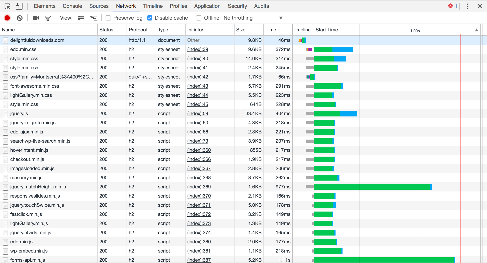
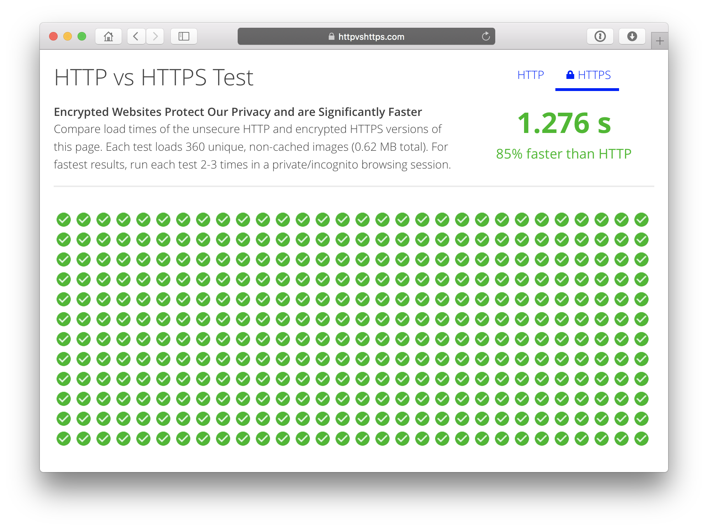

## Performance Best Practices in the HTTP/2 Era

Hypertext Transfer Protocol (HTTP) has been around since 1991, and we haven’t seen a major update since 1999, when HTTP/1.1 was released. During this time a lot of performance best practices have been passed around the web to try and circumvent some of the shortcomings in HTTP/1.1.

Sites such as [Pingdom](https://tools.pingdom.com/) and [GTmetrix](https://gtmetrix.com/) are the de facto when it comes to measuring a site’s performance and for the most part they’re excellent tools. However, some of their recommendations aren’t relevant in the era of HTTP/2.


### 新特性

* 多路复用（http请求变廉价了）
* 首部压缩
* 服务端推送
* 以https为基础

### 最佳实践

* 使用浏览器缓存
* 资源压缩
* 减少DNS查找（减少不同域名数量）
* 减少重跳
* 使用CDN

### 与http1.1相比需要修改的地方

* 因为http 请求变廉价了，按需加载，不强制都打包在一起

* 可以不用雪碧图了，除了svg雪碧图
* 减少内联代码的量
* 减少不同域名的数量


## What’s New?

Let’s take a look at what’s new in HTTP/2 and what that means for performance best practices going into 2017.

### Fully Multiplexed(多路复用)

This is arguably the flagship feature of HTTP/2, which fixes one of the biggest problems with HTTP/1.1, namely [head-of-line blocking](https://en.wikipedia.org/wiki/Head-of-line_blocking). In layman’s terms it means that only one request can be outstanding on a connection at a time, resulting in latency. This is because the next request is only issued once the response to the current request has been received, resulting in a “queue” of assets to be downloaded from the server.

In an attempt to circumvent this issue a browser may open multiple TCP connections, allowing assets to be downloaded in parallel. However, browsers have a limit on the number of TCP connections that can be open simultaneously to a single host. This can range from 2-8 depending on the browser, so as not to flood network traffic. Opening a new TCP connection in itself can cause latency, especially when HTTPS is involved, due to negotiating a TLS session.

Multiplexing fixes these issues by allowing multiple requests and responses to be handled by a single TCP connection at the same time. This allows the browser to begin downloading assets as it finds them in the DOM, without having to wait for a TCP connection to become available. Latency is also reduced, because the handshake process when establishing a new TCP connection only has to happen once per host.

You can see the impact multiplexing has by comparing waterfall results. HTTP/1.1 starts downloading assets as TCP connections become available:


HTTP/2 on the other hand downloads them in parallel:



基于二进制分帧层，HTTP2.0可以在共享TCP链接的基础上同时发送请求和响应。HTTP消息被分解为独立的帧，而不破坏消息本身的语义，交错发出去，在另一端根据流标识符和首部将它们重新组装起来。


### Header Compression(首部压缩)

All HTTP requests and responses have headers, which allows the client and server to attach additional information to the request or response. A typical response from `https://deliciousbrains.com` will return the following headers:

```
HTTP/1.1 200 OK
Server: nginx
Date: Tue, 06 Dec 2016 10:15:02 GMT
Content-Type: text/html; charset=UTF-8
Connection: keep-alive
Vary: Accept-Encoding
Link: <https://deliciousbrains.com/wp-json/>; rel="https://api.w.org/"
Link: <https://deliciousbrains.com/>; rel=shortlink
X-Frame-Options: SAMEORIGIN
X-Content-Type-Options: nosniff
X-Xss-Protection: 1; mode=block
Fastcgi-Cache: HIT
Strict-Transport-Security: max-age=31536000;
```

But, headers can also contain information such as cookies or referrers, which quickly increase their size. On sites with large amounts of requests this can quickly add up and increase the time on the wire before the client even begins handling the response.

Most assets will contain the same response and request headers, therefore it’s inefficient to re-send them on every request. HTTP/2 uses an index table, which stores the headers received from the first request it handles. Subsequent requests then only have to send the index of the duplicate header, opposed to the full textual value. Unique headers or headers that have changed are sent as normal.

Header compression can decrease the header sizes by an average of 30%, according to tests carried out by [KeyCDN](https://www.keycdn.com/blog/http2-hpack-compression/), which isn’t something to be sniffed at!

### Server Push(服务器推送)

Traditionally, when a browser requests a page, the server sends the HTML in the response, and then needs to wait for the browser to parse the HTML and issue requests for all of the assets before it can start sending the CSS, JS, etc. Server push allows this round trip to be circumvented by allowing the server to send any assets to the client it thinks it may need. For example, when a page is requested it’s probably going to need a stylesheet.

Unlike the other new features in HTTP/2, server push requires additional thought and configuration before it can be implemented and is an ongoing [area of experimentation](https://24ways.org/2016/http2-server-push-and-service-workers/). If not configured correctly it can harm performance, so it’s probably better left alone for the time being.

### Requires HTTPS

In order to use HTTP/2 you must also enable HTTPS. Although the HTTP/2 specification doesn’t stipulate that HTTPS is required, no browser is yet to implement it without requiring encryption. This may seem counter intuitive as I mentioned earlier that opening HTTPS connections can be slower than regular HTTP. In many cases due to multiplexing, the number of TLS sessions that need to be established is significantly reduced.

[HTTP vs HTTPS Test](https://www.httpvshttps.com/) compares the load times of HTTP/1.1 and HTTP/2. In this test HTTP/2 was 85% quicker than HTTP/1.1!



## Best Practices

As previously demonstrated, enabling HTTP/2 alone can have a significant impact on your site’s performance, but there are additional best practices to ensure optimal load times.

### Leverage Browser Caching

Regardless of which HTTP version is used to fetch assets from the server it’s still a slow and sometimes expensive process. Each asset should have a `Cache-Control` header, which specifies how long the browser can cache the file locally. Once a file is cached, subsequent visits to your site will be quicker because the browser doesn’t have to download those assets again. For assets that don’t frequently change they should have a cache time of 1 year.

使用浏览器缓存

### Minify and Gzip Assets

Static files such as CSS and JS should be compressed by the server before sending them to the browser. This can reduce file sizes by up to 90%, which can significantly reduce the time it takes to download each asset.

Gzip压缩

### Reduce DNS lookups

Before the browser can begin sending requests to a host it must first establish the server’s IP address by performing a DNS lookup. A typical DNS lookup can take anywhere from 20ms – 120ms, depending on your DNS provider, and whether you need to query the root namservers. The easiest way to reduce DNS lookups is to ensure your assets are served from as few hosts as possible. It’s not uncommon to see the following domains:

- googleapis.com
- google-analytics.com
- cloudflare.com
- gravatar.com

Reducing the number of hosts will not only reduce DNS lookups, but multiplexing in HTTP/2 will be used to its full potential.

减少DNS的域名查找，并且使用多路复用

### Reduce Redirects

HTTP 301 or 302 redirects are sometimes inevitable due to content moving. However, every effort should be made to keep them to a minimum and you should avoid redirect chains at all costs. Every redirect will incur an additional round trip from the browser to the server and increase latency.

减少重跳

### Use a CDN

Although using a CDN causes an extra DNS lookup and requires an additional TCP connection, the speed improvements far outweigh the negatives. Serving assets from geographic locations closer to your users will dramatically decrease the download time of assets. You should also remember to enable HTTP/2 support via your CDN control panel. Not all providers have it enabled by default.

使用CDN服务器。

## What Needs to Change?

The majority of best practices for HTTP/1.1 will continue to be beneficial for HTTP/2, however, there are a few that may actually harm performance. Let’s look at each of these practices separately.

### Concatenation

In HTTP/1.1 it was quicker to download a single file as opposed to several smaller files. As a result it was best practice to concatenate your site’s CSS and JS. In a HTTP/2 era, HTTP requests are cheap, therefore creating a single concatenated file is often unnecessary and an anti-practice for two reasons:

1. The concatenated file would often contain components not required by the current page. For example, your blog page might load components that are only used on your checkout pages.
2. If a single component changed then the entire concatenated file would need to be invalidated from the browser cache.

Both of the above increase the amount of data which needs to be downloaded from the server to the browser. However, concatenation still does have it’s place due to compression ratios. Generally, larger files yield better compression results, thus reducing the total overall file size of your page. Although HTTP/2 requests are cheap you may see improved performance by concatenating modules logically, like so:

```
styles/global.css
styles/blog.css
```

Opposed to serving each module separately:

```
styles/header.css
styles/sidebar.css
styles/footer.css
styles/blog.css
```

因为多路复用，所以http请求变得廉价了，不是所有的资源都需要打包在一起了，尽量使用按需加载的方式打包，不强制要求都打包在一起。


### Image Sprites

Similar to concatenation, it’s no longer necessary to bundle up your site’s images into a single sprite sheet. The exception to this rule is when using SVG files. A single SVG file may yield better compression results, but this is something you will need to test on a case by case basis.

也就不需要强制使用雪碧图了，除了svg的雪碧图，，因为合并出来的图反而比较大。

### Inlining

One method of reducing HTTP requests in HTTP/1.1 was to inline assets. This was especially common for images which could be converted into a [data URI](https://css-tricks.com/data-uris/) and loaded by the browser without making an additional request to the server. The problem with this technique is that the asset can’t be cached by the browser and will therefore be downloaded (as part of the page source) on every request.

同样的原因，可以不用内联的方式写在html中了。。。因为html是不能缓存的，所以内联的代码也是会每次都请求的。不强制，就是尽量减少内联代码的大小

### Domain sharding

Domain sharding was an advanced technique, which would trick the browser into downloading more assets in parallel. For example, if you were serving your assets from your local server the client may only be able to download 2-8 files simultaneously (due to the TCP connection limit mentioned previously). However, if you split your assets across three domains, the browser could download 6-24 files in parallel. That’s why it was common to see assets linked from multiple domains, like so:

- cdn1.domain.com
- cdn2.domain.com
- cdn3.domain.com

This is an anti-practice because multiplexing can no longer be used to it’s full potential and it increases the number of DNS lookups.

减少域名数量

## Conclusion

It’s been an exciting couple of years for the web, with the widespread adoption of [HTTP/2 and Let’s Encrypt](https://deliciousbrains.com/http2-https-lets-encrypt-wordpress/). Not only is the web becoming faster and more secure, but it’s easier than ever for developers and site owners to implement performance and security best practices.

There are arguably no [drawbacks](https://deliciousbrains.com/performance-best-practices-http2/#https) to making the switch to HTTP/2. All major browsers support version 2 of the protocol and those that don’t will fallback to HTTP/1.1. Sites with a large amount of external assets or those already running on HTTPS will see the biggest increase in performance, but at the very least you will no longer have to worry about concatenation, inlining or domain sharding.