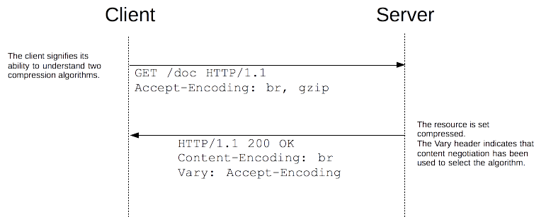
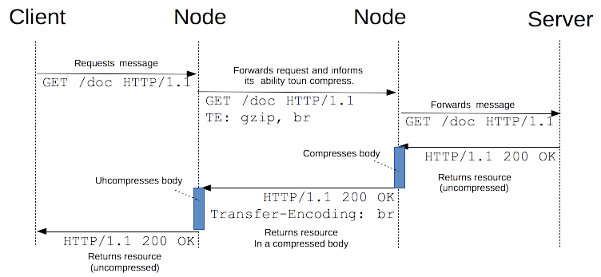

## gzip压缩

在实际应用时，web 开发者不需要亲手实现压缩机制，浏览器及服务器都已经将其实现了，不过他们需要确保在服务器端进行了合理的配置。数据压缩会在三个不同的层面发挥作用：


- 首先某些格式的文件会采用特定的优化算法进行压缩(图片文件，通过压缩软件，尽可能地压缩)
- 其次在 HTTP 协议层面会进行通用数据加密，即数据资源会以压缩的形式进行端到端传输，(client <=> server，一般通过gzip压缩方法，需要在服务端进行配置)
- 最后数据压缩还会发生在网络连接层面，即发生在 HTTP 连接的两个节点之间。(逐跳压缩技术)


 ### 端到端压缩技术

端到端压缩技术指的是消息体压缩是在服务器端完成的，并且在传输过程中保持不变，直到抵达客户端。不管途中遇到什么样的中间节点，它们都会使消息体保持原样。




由于压缩技术可以带来很大的性能提升，建议对除了已经经过压缩的文件如__图片、音频和视频文件之外的__其他类型的文件均进行应用。


### 逐跳压缩技术(用得较少了)

逐跳压缩技术尽管与端到端压缩技术有些类似，但是它们在一点上有着本质的区别，即这里的压缩指的不是对源头服务器上的资源的压缩，以此来创建一份特定的展现形式然后进行传输，而是对客户端与服务器端之间的任意两个节点之间传递的消息的主体的压缩。在两个相邻的中间节点之间的连接上，可能会应用不同的压缩方式。


`TE`首部和`Transfer-Encoding`首部最常用来发送分块响应，允许在获得资源的确切长度之前就可以开始传输。




## Nginx 配置GZip压缩


```
gzip on;
gzip_min_length  5k;
gzip_buffers     4 16k;
#gzip_http_version 1.0;
gzip_comp_level 3;
gzip_types       text/plain application/x-javascript text/css application/xml text/javascript application/x-httpd-php image/jpeg image/gif image/png;
gzip_vary on;
```

