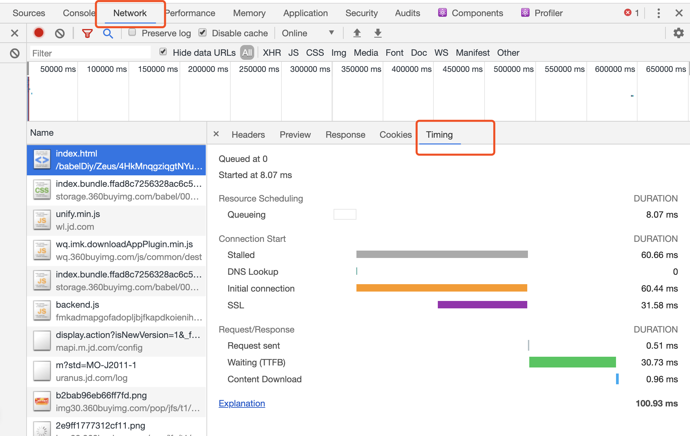

## The life and timings of a network request

在chrome的开发者工具中，可以看到资源文件网络请求的整个时间段和周期。

__Queueing__ : 请求排队的时间。关于这个，需要知道一个背景，就是浏览器与同一个域名建立的TCP连接数是有限制的，chrome设置的6个，如果说同一时间，发起的同一域名的请求超过了6个，这时候就需要排队了，也就是这个Queueing时间

__Stalled__ : 是浏览器得到要发出这个请求的指令，到请求可以发出的等待时间，一般是代理协商、以及等待可复用的TCP连接释放的时间，不包括DNS查询、建立TCP连接等时间等
__DNS Lookup__ :  DNS查询的时间，页面内任何新的域名都需要走一遍 完整的DNS查询过程，已经查询过的则走缓存
__Initial Connection / Connecting__ :  建立TCP连接的时间，包括TCP的三次握手和SSL的认证
__SSL__: 完成ssl认证的时间
__Request sent/sending__: 请求第一个字节发出前到最后一个字节发出后的时间，也就是上传时间
__Waiting__:  请求发出后，到收到响应的第一个字节所花费的时间(Time To First Byte)
__Content Download__:  收到响应的第一个字节，到接受完最后一个字节的时间，就是下载时间

stalled阶段时TCP连接的检测过程，如果检测成功就会继续使用该TCP连接发送数据，如果检测失败就会重新建立TCP连接。所以出现stalled阶段过长，往往是丢包所致，这也意味着网络或服务端有问题。