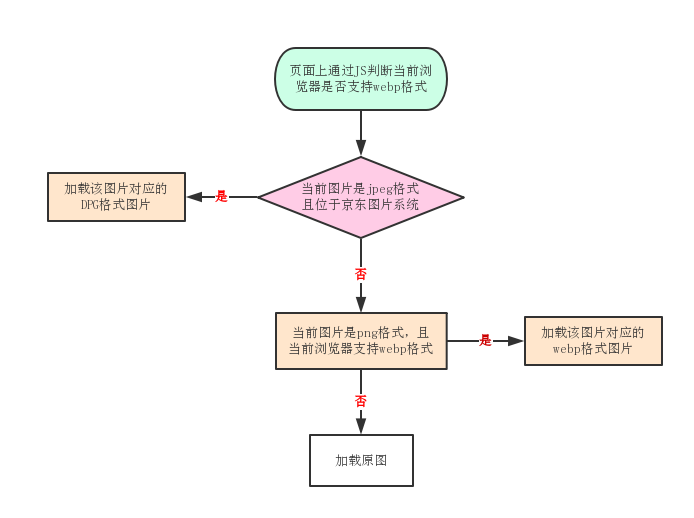

## 图片格式优化

​      典型的电商页面，会包含大量的图片。使用新兴的图片格式可以大大减少加载的图片体积，并有助于提升图片的解析和渲染速度，进而提升页面渲染速度。对于移动web来说，还有一个重要的优点——节省用户的流量（中国移动30M5块钱呢，哈哈）。

​       去年我们在项目里应用了 `WebP` 格式，收效不错。比如某张背景图片，压缩后的 png 格式是35KB，而转成 `WebP` 只有4KB，两者基本看不出质量上的差别。

​       新兴图片格式的应用的主要障碍还是兼容性，以 `WebP` 为例，谷歌系的浏览器以及欧朋浏览器支持情况良好，Firefox、Edge 也都在新版本提供了支持，可惜苹果公司一直没有跟进，Safari 直到现在也没有要支持的迹象，iOS 上的应用如果想支持，还需自行打包解析库。

​       我们使用 `WebP` 的方式是在页面上通过JS判断当前浏览器是否支持 `WebP`，如果支持，则在 body 上增加一个名为 “webp” 的 class，同时把判断结果写入 localStorage，之后再进入页面时直接从 localStorage 里读取，不用每次都执行判断的代码了。然后在页面的 css 中通过 “.webp” 选择器、在 Vue 的图片过滤器中通过判断结果来决定是否加载 `WebP` 格式图片。

```
document.createElement('canvas').toDataURL('image/webp').indexOf('data:image/webp') === 0
```

​       这次的优化，我们考虑增加对我厂 `DPG` 图片格式的支持。

> DPG 是我厂推出的图片压缩技术，经过 DPG 压缩后的图片兼容 jpeg，同时全平台、全部浏览器都支持，DPG 是一种有损压缩技术，但通过5名用户10000张图片的人眼浏览测试，和 WebP 的清晰度对比没有差距。该技术可以有效地减少图片大小50%，减少 CDN 带宽流量 50%，加快图片用户在设备上的渲染速度。

​       基于我个人的理解， `DPG` 格式应该是对 jpeg 格式图片通过一定算法进行了二次压缩，其本质上还是 jpeg（虽然扩展名改了），这也才能有所谓”全平台浏览器支持“的可能性。所以，特别适合将 jpeg 格式的图片替换为 `DPG` 格式，当然前提是服务器上有 `DPG` 格式图片。我厂的图片系统会自动生成上传图片对应的 `DPG` 格式图片。所以我们定的 `DPG` 格式使用条件就是原图是 jpeg 格式，且图片位于我厂图片系统中。在兼顾既有的 `WebP` 格式图片加载逻辑的基础上，我们梳理后的图片加载逻辑如下图所示：





### 判断是否支持webp

```
document.createElement('canvas').toDataURL('image/webp').indexOf('data:image/webp') === 0

HTMLCanvasElement.toDataURL() 方法返回一个包含图片展示的 data URI 。可以使用 type 参数其类型，默认为 PNG 格式。图片的分辨率为96dpi。
```

如果支持，`document.createElement('canvas').toDataURL('image/webp')`返回如下：

```
data:image/webp;base64,UklGRrgAAABXRUJQVlA4WAoAAAAQAAAAKwEAlQAAQUxQSBIAAAABBxARERCQJP7/H0X0P+1/QwBWUDgggAAAAHANAJ0BKiwBlgA+bTaZSaQjIqEgKACADYlpbuF2sRtACewD32ych77ZOQ99snIe+2TkPfbJyHvtk5D32ych77ZOQ99snIe+2TkPfbJyHvtk5D32ych77ZOQ99snIe+2TkPfbJyHvtk5D32ych77ZOQ99qwAAP7/1gAAAAAAAAAA
```

否则，返回如下：

```
data:image/png;base64,iVBORw0KGgoAAAANSUhE...
```


## 不同业务场景下的图片方案选型

根据不同的业务场景进行不同的图片选型。

参考网址: https://juejin.im/book/5b936540f265da0a9624b04b/section/5b98ceb46fb9a05d3154f6bd


图片类型：

### JPEG/JPG

关键字：**有损压缩、体积小、加载快、不支持透明**


### PNG-8 与 PNG-24

关键字：**无损压缩、质量高、体积大、支持透明**


### SVG

关键字：**文本文件、体积小、不失真、兼容性好**


### Base64

关键字：**文本文件、依赖编码、小图标解决方案**


### WebP

关键字：**年轻的全能型选手**


## 具体优化实现

目前页面上渲染图片的时候，图片有两种来源

* img标签，展示从接口返回的图片地址
* background-image，固定的图片地址


### img标签的优化

每个厂应该都有对应的图片优化方法，通用的话，就只有webp了，通过判断是否支持webp，在url的后面添加上`.webp`


### background-image

还是做webp的优化，如果支持webp，则在body上添加一个webp的类名，需要在js等代码之前，避免重复加载了两次background-image。

```
// Webp能力探测
try{
  if (document.createElement("canvas").toDataURL("image/webp").indexOf("data:image/webp") == 0) {
		document.body.classList.add('webp');
	}
}catch(e){console.log(e)}
```


## 存在的问题

1. webp图片返回更大了

原因还不晓得，可能和编码有关系，但是什么情况下...


2. webp之后返回404

服务器端不支持webp格式的解析，需要配置下