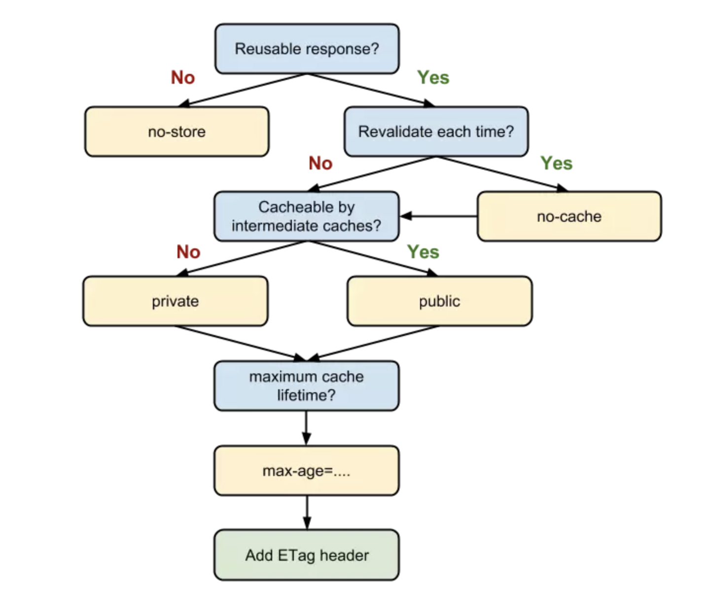
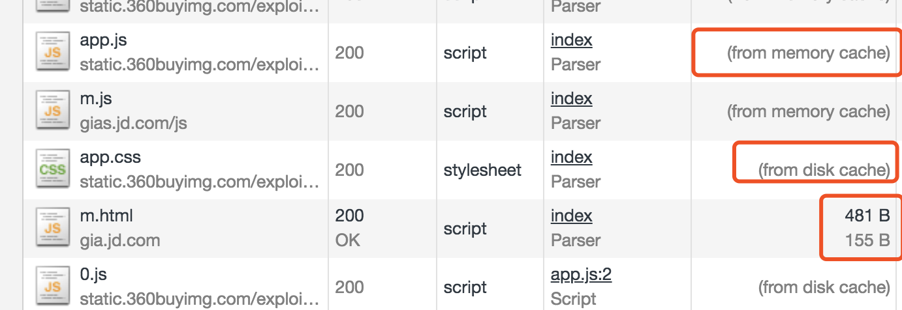

# 浏览器缓存机制介绍与缓存策略剖析

参考网址： <https://juejin.im/book/5b936540f265da0a9624b04b/section/5b9ba651f265da0ac726e5de>


缓存可以减少网络I/O消耗，提高访问速度。是一种简单、效果显著的前端优化手段。chrome官方给出的解释如下：

```
通过网络获取内容既速度缓慢又开销巨大。较大的响应需要在客户端与服务器之间进行多次往返通信，这会延迟浏览器获得和处理内容的时间，还会增加访问者的流量费用。因此，缓存并重复利用之前获取的资源的能力成为性能优化的一个关键方面。
```

事实上，浏览器缓存机制有四个方面，按照获取资源时请求的优先级依次排列如下：

1. Memory Cache
2. Service Worker Cache
3. HTTP Cache
4. Push Cache






这是随便打开一个网页后在浏览器开发者工具的Network栏发现的细节。


### 浏览器Network的Size栏

在浏览器开发者工具的Network的Size栏会出现的三种情况：

- from memory cache
- from disk cache(HTTP强缓存)
- 资源本身大小（比如：13.6K）

不同的浏览器和不同的HTTP协议，会展示不同的缓存


## HTTP缓存机制

HTTP缓存是常用的一种缓存机制，分为__强缓存__和__协商缓存__。优先级较高的是强缓存，在命中强缓存失败的情况下，才会走协商缓存。


### 强缓存

利用http头中的Expires和Cache-Control两个字段控制。强缓存命中，直接从缓存中获取资源，不会再与服务端发生通信。

cache-control: no-cache

每一次发起请求都不会再去询问浏览器的缓存情况，而是直接向服务端去确认该资源是否过期。

Cache-control: no-store

不使用任何缓存策略。在no-cache的基础上，它连服务端的缓存确认也绕开了，只允许你直接向服务端发送请求、并下载完整的响应。


### 协商缓存：浏览器与服务器合作制下的缓存策略

依赖于服务端与浏览器之间的通信。

协商缓存机制下，浏览器需要向服务器去询问缓存的相关信息，进而判断是重新发起请求、下载完整的响应，还是从本地获取的缓存。

通过Last-Modified和Etag两个字段控制


### 三级缓存原理

1. 先查找内存，如果内存中存在，从内存中加载；
2. 如果内存中未查找到，选择硬盘获取，如果硬盘中有，从硬盘中加载；
3. 如果硬盘中未查找到，那就进行网络请求；
4. 加载到的资源缓存到硬盘和内存；


### HTTP状态码及区别

* **200 form memory cache**
   不访问服务器，一般已经加载过该资源且缓存在了内存当中，直接从内存中读取缓存。**浏览器关闭后，数据将不存在**（资源被释放掉了），再次打开相同的页面时，不会出现from memory cache。

* **200 from disk cache**
   不访问服务器，已经在之前的某个时间加载过该资源，直接从硬盘中读取缓存，**关闭浏览器后，数据依然存在**，此资源不会随着该页面的关闭而释放掉下次打开仍然会是from disk cache。

* **304 Not Modified**
   访问服务器，发现数据没有更新，服务器返回此状态码。然后从缓存中读取数据。


| 状态 | 类型              | 说明                                                         |
| ---- | ----------------- | ------------------------------------------------------------ |
| 200  | form memory cache | 不请求网络资源，资源在内存当中，一般脚本、字体、图片会存在内存当中 |
| 200  | form disk ceche   | 不请求网络资源，在磁盘当中，一般非脚本会存在内存当中，如css等 |
| 200  | 资源大小数值      | 从服务器下载最新资源                                         |
| 304  | 报文大小          | 请求服务端发现资源没更新，使用本地资源                       |

一般样式表会缓存在磁盘中，不会缓存到内存中，因为css样式加载一次即可渲染出页面。但是脚本可能会随时执行，如果把脚本存在磁盘中，在执行时会把该脚本从磁盘中提取到缓存中来，这样的IO开销比较大，有可能会导致浏览器失去响应。


### 几种状态的执行顺序

现加载一种资源（例如：图片）：
**访问-> 200 -> 退出浏览器再进来-> 200(from disk cache) -> 刷新 -> 200(from memory cache)**